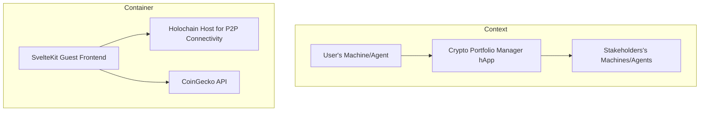

# Crypto Portfolio Manager Application Specification Document

## 1. Introduction

This document outlines the specifications for the Crypto Portfolio Manager Application, a cryptocurrency portfolio management tool designed for both individual and collaborative use. The application is built with a focus on local-first and peer-to-peer architecture, leveraging technologies such as TypeScript, SvelteKit, and potentially Holochain for the peer-to-peer functionality.

## 2. Purpose

The primary purpose of the Crypto Portfolio Manager Application is to provide a user-friendly interface for managing cryptocurrency portfolios. It aims to facilitate the creation, viewing, and analysis of portfolios, including the addition and removal of coins, tracking transactions, and offering detailed insights into portfolio value and stakeholder contributions. The application is designed to be accessible and secure, with a strong emphasis on local-first and peer-to-peer connectivity for privacy and collaboration.

## 3. Scope

The application will integrate with the CoinGecko API to fetch real-time currency data. It will support the creation and management of portfolios, including the ability to add and remove coins, track transactions, and calculate portfolio value based on current prices and historical transactions. The application will also support multiple stakeholders, allowing for collaborative portfolio management with detailed analysis and transaction history.

## 4. Technical Specifications

### 4.1 Technology Stack

- **Frontend**: SvelteKit, TypeScript
- **Backend**: Rust, Holochain
- **Peer-to-Peer Connectivity**: Holochain for distributed and secure peer-to-peer networking
- **API Integration**: CoinGecko API for cryptocurrency data

### 4.2 Advantages of Using Holochain

Holochain offers several advantages for the Crypto Portfolio Manager Application:
****
- **Decentralization**: Holochain's decentralized architecture ensures that data is not stored in a single location, reducing the risk of data loss or manipulation.
- **Security**: Holochain's cryptographic and permissioned data model ensures that only authorized users can access and modify data, enhancing the security of the application.
- **Scalability**: Holochain's design allows for easy scaling, accommodating the growth of the application and its user base.
- **Interoperability**: Holochain's ability to integrate with other blockchain technologies and APIs, such as the CoinGecko API, facilitates the seamless exchange of data and functionality.

### 4.3 Distributed Hash Table (DHT) Schema

The application will utilize a Distributed Hash Table (DHT) for storing and retrieving data in a decentralized manner. The DHT will be structured to efficiently manage portfolio data, including:

- **Portfolio Data**: Stores information about each portfolio, including its name, current value, and creation/update timestamps.
- **Coin Data**: Contains details about each cryptocurrency, including its name, symbol, and current price.
- **Transaction Data**: Records all transactions made within the portfolios, including the coin involved, the amount, the price at the time of the transaction, and the timestamp.
- **Stakeholder Data**: Manages information about each stakeholder, including their name and contributions to portfolios.

This schema ensures that data is distributed across the network, enhancing the application's resilience and security.

## 5. Features

### 5.1 Core Features

- **List All Coins**: Display a comprehensive list of all available cryptocurrencies.
- **Show Coin Details**: Provide detailed information about individual cryptocurrencies.
- **Create Portfolio**: Allow users to create and manage their own portfolios.
- **Add/Remove Coins**: Enable users to add and remove coins from their portfolios.
- **Show Portfolio**: Display the current state of a user's portfolio.
- **Add Transactions**: Allow users to add buy and sell transactions to their portfolios, with transactions assigned to individual stakeholders.
- **Show Transactions**: Display a history of transactions for a portfolio or a coin.
- **Calculate Portfolio Value**: Calculate the current value of a portfolio based on transaction history and current coin prices.
- **Stakeholder Contributions**: Provide detailed analysis of portfolio value and contributions from multiple stakeholders.

### 5.2 Additional Features

- **Local-First Approach**: The application will run locally on the user's machine, ensuring data privacy and reducing reliance on external servers.
- **Peer-to-Peer Connectivity**: Facilitate direct connections between stakeholders, enhancing collaboration, data sharing, and privacy.
- **Cryptographically Secure Transactions**: Holochain's cryptographic and permissioned data model ensure the immutability and security of transaction history.
- **Overlapping Portfolios Analysis**: Enable users to compare multiple portfolios and identify common investments, including cryptocurrencies and NFTs.

### 5.3 Use Cases

#### 5.3.1 Individual Investors

- **Personal Finance Management**: Manage personal investments in cryptocurrencies and NFTs.
- **Educational Tool**: Learn about cryptocurrencies and NFTs through real-time data analysis.

#### 5.3.2 Financial Advisors and Brokers

- **Client Portfolio Management**: Manage and analyze portfolios for clients.
- **Collaborative Portfolio Analysis**: Analyze and compare portfolios for investment opportunities.

#### 5.3.3 Investment Groups and Clubs

- **Collaborative Investment Strategies**: Manage collective investments and diversify risk.
- **Decision-Making and Strategy Development**: Collaborate on investment strategies and decisions.

#### 5.3.4 Educational Institutions and Courses

- **Teaching and Learning**: Use as a teaching tool in finance and investment courses.
- **Research and Analysis**: Conduct research and analysis on market trends and investment strategies.

#### 5.3.5 Non-Profit Organizations and Community Projects

- **Community Investment**: Manage community investments transparently.
- **Collaborative Projects**: Facilitate collective investments and shared ownership.

#### 5.3.6 Entrepreneurs and Startups

- **Fundraising and Investment**: Manage fundraising and investment portfolios.
- **Collaborative Ventures**: Collaborate with investors and partners on shared investments.

#### 5.3.7 Hobbyists and Enthusiasts

- **Hobby Investment**: Manage hobby investments in cryptocurrencies and NFTs.
- **Community Building**: Connect and collaborate with other hobbyists.

## 6. Non-Functional Requirements

- **Usability**: Designed with a focus on user-friendliness.
- **Performance**: Optimized for fast loading times and responsive interactions.
- **Security**: Incorporates robust security measures to protect user data and transactions.

## 7. Conclusion

This specification document outlines the key features, technical specifications, and non-functional requirements for the Crypto Portfolio Manager Application. By adhering to these specifications, the development team will ensure the application meets its intended purpose and provides a secure, efficient, and user-friendly solution for managing cryptocurrency portfolios.
