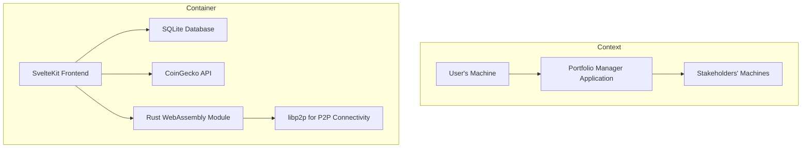

# Crypto Portfolio Manager Application Specification Document

##  1. Introduction

This document outlines the specifications for the Crypto Portfolio Manager Application, a cryptocurrency portfolio management tool designed for both individual and collaborative use. The application is built with a focus on local-first and peer-to-peer architecture, leveraging technologies such as TypeScript, SvelteKit, SQLite, and potentially Rust and WebAssembly with the `libp2p` library for the peer-to-peer functionality.

##  2. Purpose

The primary purpose of the Crypto Portfolio Manager Application is to provide a user-friendly interface for managing cryptocurrency portfolios. It aims to facilitate the creation, viewing, and analysis of portfolios, including the addition and removal of coins, tracking transactions, and offering detailed insights into portfolio value and stakeholder contributions. The application is designed to be accessible and secure, with a strong emphasis on local-first and peer-to-peer connectivity for privacy and collaboration.

##  3. Scope

The application will integrate with the CoinGecko API to fetch real-time currency data. It will support the creation and management of portfolios, including the ability to add and remove coins, track transactions, and calculate portfolio value based on current prices and historical transactions. The application will also support multiple stakeholders, allowing for collaborative portfolio management with detailed analysis and transaction history.

##  4. Technical Specifications

###  4.1 Technology Stack

- **Frontend**: SvelteKit, TypeScript
- **Backend**: SvelteKit, SQLite (local database)
- **Peer-to-Peer Connectivity**: Potential use of Rust WebAssembly with the `libp2p` library
- **API Integration**: CoinGecko API for cryptocurrency data

### 4.2 SQLite Database Integration

- Local Database Storage: The application will use SQLite as its primary database for storing portfolio data, transactions, and other relevant information. SQLite databases are stored as a single file on the user's machine, making them ideal for the application that need to store data locally.
- Data Operations: The application will perform CRUD (Create, Read, Update, Delete) operations on the SQLite database to manage portfolios, transactions, and other data. This includes adding and removing coins from portfolios, recording transactions, and calculating portfolio values based on current prices and historical transactions.
- Encryption: To enhance security, the SQLite database file will be encrypted. This ensures that the data stored in the database is protected from unauthorized access. The application will provide mechanisms for users to set and manage encryption keys.
- Data Synchronization: Given the peer-to-peer nature of the application, a mechanism for synchronizing data across all instances of the application will be implemented. This could involve using the libp2p crate to facilitate data exchange between peers, ensuring that all users have access to the most up-to-date portfolio information.
- Browser Compatibility and WebAssembly: While SQLite is primarily a server-side technology, the application will leverage WebAssembly to run SQLite in the browser for client-side data storage. This allows the application to function offline and provides a seamless user experience. However, direct file system access from WebAssembly in the browser is limited and may require user permission.
  
### 4.3 Security Considerations

- Data Privacy and Security: The application will adhere to best practices for data privacy and security. This includes encrypting the SQLite database file, validating inputs to prevent SQL injection attacks, and managing user permissions appropriately.
- Cryptographically Secure Storage: Transactions and other sensitive data will be stored securely, ensuring an immutable history. The application will provide mechanisms for users to set and manage encryption keys, ensuring that data is protected from unauthorized access.

##  5. Features

###  5.1 Core Features

- **List All Coins**: Display a comprehensive list of all available cryptocurrencies.
- **Show Coin Details**: Provide detailed information about individual cryptocurrencies.
- **Create Portfolio**: Allow users to create and manage their own portfolios.
- **Add/Remove Coins**: Enable users to add and remove coins from their portfolios.
- **Show Portfolio**: Display the current state of a user's portfolio.
- **Add Transactions**: Allow users to add buy and sell transactions to their portfolios, with transactions assigned to individual stakeholders.
- **Show Transactions**: Display a history of transactions for a portfolio or a coin.
- **Calculate Portfolio Value**: Calculate the current value of a portfolio based on transaction history and current coin prices.
- **Stakeholder Contributions**: Provide detailed analysis of portfolio value and contributions from multiple stakeholders.

###  5.2 Additional Features

- **Local-First Approach**: The application will run locally on the user's machine, ensuring data privacy and reducing reliance on external servers.
- **Peer-to-Peer Connectivity**: Facilitate direct connections between stakeholders, enhancing collaboration, data sharing, and privacy.
- **Cryptographically Secure Transactions**: Ensure the immutability and security of transaction history.
- **Overlapping Portfolios Analysis**: Enable users to compare multiple portfolios and identify common investments, including cryptocurrencies and NFTs.

###  5.3 Use Cases

####  5.3.1 Individual Investors

- **Personal Finance Management**: Manage personal investments in cryptocurrencies and NFTs.
- **Educational Tool**: Learn about cryptocurrencies and NFTs through real-time data analysis.

####  5.3.2 Financial Advisors and Brokers

- **Client Portfolio Management**: Manage and analyze portfolios for clients.
- **Collaborative Portfolio Analysis**: Analyze and compare portfolios for investment opportunities.

####  5.3.3 Investment Groups and Clubs

- **Collaborative Investment Strategies**: Manage collective investments and diversify risk.
- **Decision-Making and Strategy Development**: Collaborate on investment strategies and decisions.

####  5.3.4 Educational Institutions and Courses

- **Teaching and Learning**: Use as a teaching tool in finance and investment courses.
- **Research and Analysis**: Conduct research and analysis on market trends and investment strategies.

####  5.3.5 Non-Profit Organizations and Community Projects

- **Community Investment**: Manage community investments transparently.
- **Collaborative Projects**: Facilitate collective investments and shared ownership.

####  5.3.6 Entrepreneurs and Startups

- **Fundraising and Investment**: Manage fundraising and investment portfolios.
- **Collaborative Ventures**: Collaborate with investors and partners on shared investments.

####  5.3.7 Hobbyists and Enthusiasts

- **Hobby Investment**: Manage hobby investments in cryptocurrencies and NFTs.
- **Community Building**: Connect and collaborate with other hobbyists.

##  6. Non-Functional Requirements

- **Usability**: Designed with a focus on user-friendliness.
- **Performance**: Optimized for fast loading times and responsive interactions.
- **Security**: Incorporates robust security measures to protect user data and transactions.

##  7. Conclusion

This specification document outlines the key features, technical specifications, and non-functional requirements for the Portfolio Manager Application. By adhering to these specifications, the development team will ensure the application meets its intended purpose and provides a secure, efficient, and user-friendly solution for managing cryptocurrency portfolios.
